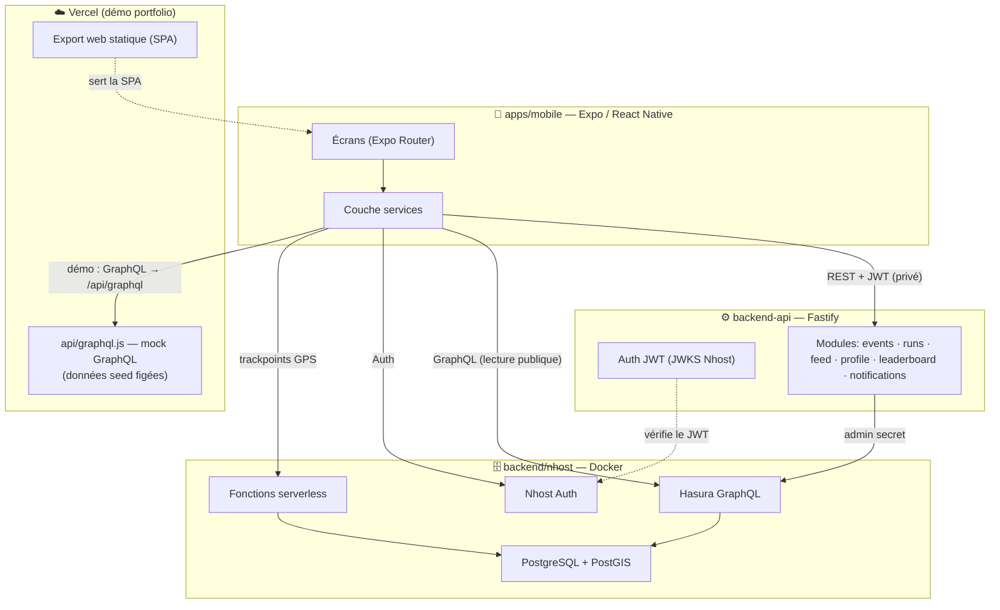

# Secret Run

[](https://github.com/lmarcx/SecretRun/actions/workflows/ci.yml)

**Secret Run** est une application de course à pied sociale et compétitive bâtie autour d'un concept simple : des **parcours secrets**. Le tracé d'un événement reste chiffré et invisible jusqu'à son heure de révélation (`reveal_at`) ; les coureurs s'inscrivent à l'aveugle, le parcours se dévoile au dernier moment, la course est suivie au GPS, validée côté serveur, puis convertie en points de saison pour des classements individuels et par équipe.

Le projet est un **monorepo full-stack** : application mobile Expo / React Native, API Node/Fastify, et stack données Nhost / Hasura / PostgreSQL+PostGIS, avec des fonctions serverless pour le cycle de vie d'une course.

> 🌐 **Démo web (portfolio)** — l'app est exportée en version web et hébergée gratuitement sur Vercel, accompagnée d'un mock backend serverless (aucun Postgres/Hasura en ligne requis). Voir [Déploiement web](#-déploiement-web-portfolio).

---

## Sommaire

- [Aperçu fonctionnel](#-aperçu-fonctionnel)
- [Stack technique](#-stack-technique)
- [Architecture](#-architecture)
- [Modèle de données](#-modèle-de-données)
- [Application mobile](#-application-mobile)
- [Backend API (Fastify)](#-backend-api-fastify)
- [Stack données (Nhost / Hasura)](#-stack-données-nhost--hasura)
- [Sécurité](#-sécurité)
- [Démarrage local](#-démarrage-local)
- [Variables d'environnement](#-variables-denvironnement)
- [Données de test (seed)](#-données-de-test-seed)
- [Qualité & tests](#-qualité--tests)
- [CI/CD](#-cicd)
- [Déploiement web (portfolio)](#-déploiement-web-portfolio)
- [Backlog & pistes d'amélioration](#-backlog--pistes-damélioration)
- [Structure du repo](#-structure-du-repo)

---

## ✨ Aperçu fonctionnel

| Domaine | Description |
| --- | --- |
| **Événements** | Liste, détail, inscription, états `révélé` / `live` / `complet` / `terminé`. Fenêtres temporelles (révélation, départ, fin) imposées côté serveur. |
| **Parcours secrets** | Tracé chiffré en base, dévoilé seulement après `reveal_at` et réservé aux participants inscrits. |
| **Course (run)** | Cycle start → trackpoints GPS → finish → validation. Calcul distance, durée, vitesse moyenne. |
| **Anti-triche** | Détection de vitesses suspectes / déplacement véhicule, table de sanctions. |
| **Classements** | Saisons, points par run, classements coureurs et équipes recalculés côté serveur. |
| **Équipes** | Création, membres, rôles (leader/membre), classement d'équipe, événements privés réservés à une équipe. |
| **Feed social** | Activités de l'utilisateur, amis et coéquipiers ; likes et commentaires. |
| **Wallet** | Récompenses de participation, login quotidien, notations ; grand livre de transactions. |
| **Social** | Amitiés, blocages. |
| **Notifications** | Enregistrement de device, jobs et rappels de départ d'événement. |

---

## 🧰 Stack technique

| Couche | Technologies |
| --- | --- |
| **Mobile** | React Native 0.81, Expo SDK 54, Expo Router (routes typées), TypeScript, `react-native-web`, `react-native-maps`, `react-native-reanimated`, `@gorhom/bottom-sheet`, `@nhost/react`, `graphql-request` |
| **Backend API** | Node 20, Fastify 5, TypeScript, Zod (validation), `jose` (JWT/JWKS) |
| **Données** | PostgreSQL + PostGIS, Hasura (GraphQL), Nhost (Auth / Storage / Functions) |
| **Serverless** | Fonctions Nhost (TypeScript) pour le cycle de vie des courses |
| **Infra locale** | Docker Compose |
| **Tooling** | pnpm workspaces, ESLint, Prettier, TypeScript, `tsc --noEmit` |
| **CI/CD** | GitHub Actions (CI), Vercel (déploiement web + previews) |

---

## 🏗 Architecture

Monorepo `pnpm` à trois tiers, plus un mock serverless dédié à la démo web.



**Deux chemins de données depuis le mobile :**

1. **Lecture publique** (events, leaderboard, teams) → directement Hasura GraphQL (ou le mock en démo).
2. **Actions authentifiées** (join, run, feed, profil) → `backend-api` en REST avec un `Bearer` JWT. L'API vérifie le token via le JWKS Nhost (RS256), puis interroge Hasura avec l'admin secret. Le mobile ne voit jamais l'admin secret.

Le mobile sait fonctionner en mode dégradé : si `backend-api` n'est pas configuré, les events retombent sur un **fallback GraphQL public** ; si l'auth Nhost n'est pas configurée, l'app reste navigable en lecture seule sans écran de login forcé (mode utilisé par la démo).

---

## 🗄 Modèle de données

PostgreSQL + PostGIS, géré par migrations Hasura (`backend/nhost/migrations`).

| Table | Rôle |
| --- | --- |
| `profiles` | Profil public (username, display name, avatar) lié à `auth.users`. |
| `teams`, `team_members` | Équipes et appartenances (rôle leader/membre). |
| `events` | Événements : fenêtres `reveal_at`/`starts_at`/`ends_at`, géométrie `start_point`/`start_area_center` (PostGIS), rayon de zone, `is_private`, `team_id`, `max_participants`. |
| `event_routes` | Tracé : `route_encrypted`, `route_polyline` (GeoJSON), `revealed`, `revealed_at`, distance/durée. |
| `event_participants` | Inscriptions (status `registered`...). |
| `activities` | Courses réalisées : distance, durée, vitesse, points, statut (`pending`/`validated`/`rejected`). |
| `activity_trackpoints` | Points GPS bruts d'une course (vitesse/séquence). |
| `activity_score_applications` | Application des points à une saison/équipe (idempotence). |
| `seasons` | Saisons de classement (active/inactive). |
| `leaderboard_user_season`, `leaderboard_team_season` | Classements matérialisés (points, rang). |
| `wallets`, `wallet_ledger` | Solde et grand livre des récompenses. |
| `sanctions` | Sanctions anti-triche. |
| `friendships` | Relations sociales (accepted/pending/rejected). |

L'usage de **PostGIS** (`ST_GeogFromText`, géométries `POINT`) permet des calculs géospatiaux (zones de départ, distances) directement en base.

---

## 📱 Application mobile

`apps/mobile` — Expo Router (file-based routing, routes typées).

**Routes principales** (`app/`) : `index` → redirige vers `/events` · `events/` (carte interactive + détail `events/[id]`) · `run/[eventId]` (suivi de course) · `feed` · `teams/` · `leaderboard` · `profile` · `settings` · `(auth)/login` · `(auth)/register`.

**Couche services** (`services/`) — séparation nette UI / accès données :

- `nhostClient` / `graphqlClient` — client Nhost et GraphQL (lectures publiques + authentifiées).
- `backendApiClient` — wrapper REST typé vers `backend-api`, injecte le `Bearer` JWT, normalise les erreurs (`BackendApiError`).
- `eventsService`, `feedService`, `teamsService`, `leaderboardService`, `profileService` — logique métier + mapping des DTO.
- `eventRoutes` / `trackpoints` — récupération du tracé révélé et envoi des points GPS.
- `betaAccessService` — contrôle d'accès à la bêta fermée (allowlist e-mail / code d'invitation).
- `devRunnerMode` — mode démo qui simule une inscription côté client sans auth.

**Web** : `react-native-web` + export Metro. `react-native-maps` est remplacé par un mock web (`metro.config.js` + `src/mocks/react-native-maps.ts`) pour que la carte compile en web. L'export web fonctionne en mode **SPA** (`output: 'single'`) afin que les routes dynamiques fonctionnent sans pré-rendu.

---

## ⚙️ Backend API (Fastify)

`backend-api` — API REST modulaire qui porte la logique métier sensible (autorisations, fenêtres temporelles, écritures).

**Modules** (`src/modules/`) : `auth` (`/me`, beta access) · `events` (`/events`, `/events/:id`, `/events/:id/route`, `/events/:id/join`) · `runs` (start/finish) · `profile` (`/profile`, `/profile/stats`) · `feed` (`/feed`) · `leaderboard` · `notifications` · `health`.

**Points clés :**

- **Auth JWT** (`modules/auth/jwt.ts`) — vérification RS256 via `jose`, clé publique en dur **ou** JWKS distant Nhost (dérivé de `NHOST_SUBDOMAIN`/`NHOST_REGION`). Cohérence `sub` ↔ `x-hasura-user-id` contrôlée.
- **Beta access** — allowlist d'e-mails (`BETA_ALLOWED_EMAILS`) ; `requireBetaAccess` / `optionalAuth` en pré-handlers.
- **Validation** — schémas Zod sur params/body/query ; gestionnaire d'erreurs central renvoyant `{ error, message, details }`.
- **Policies** (`modules/events/policy.ts`) — fenêtres `join`/`start`/`finish` validées contre `reveal_at`/`starts_at`/`ends_at`.
- **Robustesse** — rate limiting (`lib/rate-limit.ts`), single-flight (`lib/single-flight.ts`) pour dédupliquer les appels concurrents, CORS configurable, accès Hasura centralisé (`lib/hasura.ts`).
- **Config** (`config/env.ts`) — variables validées par Zod au démarrage ; échoue vite en production si l'auth n'est pas configurée.

---

## 🗃 Stack données (Nhost / Hasura)

`backend/nhost` — stack locale via Docker Compose : PostgreSQL+PostGIS, Hasura, services Nhost (Auth/Storage/Functions).

**Fonctions serverless** (`functions/`, TypeScript) — cycle de vie d'une course :

| Fonction | Rôle |
| --- | --- |
| `generate-event-route` | Génère et chiffre le tracé d'un événement. |
| `reveal-events` | Dévoile les parcours dont `reveal_at` est atteint. |
| `start-activity` / `finish-activity` | Démarre / clôture une course. |
| `trackpoint` | Ingestion des points GPS pendant la course. |
| `validate-activity` | Validation serveur (cohérence, anti-triche). |
| `score-activity` | Calcul des points d'une activité validée. |
| `update-leaderboards` | Recalcul des classements de saison. |
| `get-activity-feed` | Construction du feed. |
| `register-device` | Enregistrement d'un device pour le push. |

**Migrations** versionnées (`migrations/`) : schéma initial, métriques de parcours, trackpoints (séquence/vitesse), détection véhicule, types de transactions wallet, événements par équipe, feed, push, règles d'accès, système d'amis/blocage.

---

## 🔒 Sécurité

- **Parcours secrets** — `route_polyline` n'est servi qu'après `reveal_at`, avec `revealed = true`, et uniquement à un participant `registered` (`modules/events/service.ts`). Le mobile ne peut pas pré-charger un tracé non révélé.
- **JWT RS256 + JWKS** — l'API ne fait jamais confiance à un user id fourni par le client ; il provient du token vérifié.
- **Séparation des secrets** — l'admin secret Hasura vit uniquement côté serveur ; le mobile n'utilise que des variables `EXPO_PUBLIC_*` (publiques par nature) et un access token utilisateur.
- **Bêta fermée** — allowlist d'e-mails + code d'invitation optionnel.
- **Défense en profondeur** — validation Zod, rate limiting, CORS restreint par origine, fenêtres temporelles serveur, anti-triche (vitesse/véhicule + sanctions).

> Note : les fichiers `*.env` du dépôt ne contiennent que des valeurs **locales de développement** (placeholders Docker). Aucun secret de production n'est versionné.

---

## 🚀 Démarrage local

**Prérequis :** Node 20+, pnpm 10+, Docker Desktop. (Nhost CLI uniquement si tu appliques des migrations via `pnpm db:migrate`.)

```powershell
pnpm install

# Copier les fichiers d'environnement d'exemple
Copy-Item backend\nhost\.env.example backend\nhost\.env
Copy-Item backend-api\.env.example  backend-api\.env
Copy-Item apps\mobile\.env.example  apps\mobile\.env

# Démarrer les 3 services (backend Docker + API Fastify + Expo)
pnpm dev:full
```

`pnpm dev:full` lance le backend Docker, l'API `backend-api` et Expo. Dans Expo : `w` ouvre la version web, ou scanne le QR code avec Expo Go.

**Commandes service par service :**

```powershell
pnpm dev:backend   # Docker (Postgres/PostGIS, Hasura, Nhost)
pnpm dev:api       # backend-api (Fastify) sur :10000
pnpm dev:mobile    # Expo (--clear)
pnpm backend:logs  # logs Docker
pnpm backend:stop  # arrêt
```

Endpoints locaux : GraphQL `http://localhost:8080/v1/graphql` · API `http://localhost:10000`.

> Sur Expo Go (téléphone réel), remplace `localhost` par l'IP LAN de ta machine dans `apps/mobile/.env`, et ajoute cette origine à `CORS_ALLOWED_ORIGINS` côté `backend-api`.

---

## 🔧 Variables d'environnement

**`backend/nhost/.env`** (Docker local) :

```env
POSTGRES_USER=postgres
POSTGRES_PASSWORD=postgres
POSTGRES_DB=secretrun
HASURA_GRAPHQL_ADMIN_SECRET=hasura-admin-secret
```

**`backend-api/.env`** :

```env
NODE_ENV=development
PORT=10000
HOST=0.0.0.0
CORS_ALLOWED_ORIGINS=http://localhost:8081
HASURA_GRAPHQL_URL=http://localhost:8080/v1/graphql
HASURA_ADMIN_SECRET=hasura-admin-secret
# Auth (prod) : NHOST_JWKS_URL ou NHOST_JWT_PUBLIC_KEY,
# dérivables depuis NHOST_SUBDOMAIN + NHOST_REGION
TEAM_EVENT_BONUS_POINTS=5
```

**`apps/mobile/.env`** (préfixe `EXPO_PUBLIC_`, jamais d'admin secret) :

```env
EXPO_PUBLIC_NHOST_SUBDOMAIN=your-subdomain
EXPO_PUBLIC_NHOST_REGION=eu-central-1
EXPO_PUBLIC_HASURA_GRAPHQL_URL=http://localhost:8080/v1/graphql
EXPO_PUBLIC_BACKEND_API_URL=http://localhost:10000
EXPO_PUBLIC_TRACKPOINTS_ENDPOINT=http://localhost:1337/v1/functions/trackpoints
```

> En mode production web (Vercel), `apps/mobile/.env.production` surcharge ces valeurs pour la démo (voir [Déploiement web](#-déploiement-web-portfolio)).

---

## 🌱 Données de test (seed)

Un seed complet permet de tester l'app de bout en bout : profils coureurs, équipes, événements (ouverts, complets, live, privés, terminés), participations, activités, classements, wallets.

```powershell
pnpm db:seed:full    # (re)pose toutes les données de test
pnpm db:seed:clear   # retire les données de test
```

**Compte de test :** `runner.demo@secretrun.local` · profil `you_runner` (Lena Nightfall) · équipe Night Owls.

> Le seed crée l'identité en base, mais un vrai login Nhost nécessite aussi un compte côté Nhost Auth avec le même e-mail. Détails dans `backend/nhost/seeds/README.md`.

---

## ✅ Qualité & tests

```powershell
pnpm lint                                          # ESLint (mobile, backend, backend-api, types)
pnpm format                                        # Prettier --write
pnpm format:check                                  # Prettier --check
pnpm --filter @secret-run/mobile exec tsc -p tsconfig.json --noEmit   # typecheck mobile
pnpm --filter @secret-run/backend-api typecheck    # typecheck API
pnpm --filter @secret-run/backend-api test         # tests API (node --test)
```

`backend-api` couvre par des tests unitaires les modules `auth` (dev-auth, routes) et `events` (routes, service).

---

## 🔁 CI/CD

**CI — GitHub Actions** (`.github/workflows/ci.yml`), sur push (`restart`, `main`) et chaque pull request :

1. Install pnpm (lockfile figé)
2. `pnpm lint`
3. Typecheck `mobile` + `backend-api`
4. Build de l'export web (`expo export --platform web`)

**CD — Vercel** : déploiement géré par l'intégration Git native (push sur la branche de prod → déploiement ; chaque PR → preview deployment). La CI et la CD sont volontairement découplées.

---

## 🌐 Déploiement web (portfolio)

L'app Expo est exportée en **web statique** et hébergée gratuitement sur **Vercel**, avec un **mock backend serverless** : aucune base Postgres/Hasura/Fastify en ligne n'est nécessaire pour la démo.

### Comment ça marche

- **Frontend** — export web Expo (mode SPA `output: 'single'`) servi en statique par Vercel.
- **Mock backend** — une fonction serverless `api/graphql.js` mocke l'endpoint GraphQL Hasura avec des **données seed figées** (`api/_data.js`, dérivées de `secret_run_full_seed.sql`), recalculées à chaque requête pour conserver des états d'événement cohérents (live / à venir / terminé).
- **Auth désactivée** — sans projet Nhost, l'app reste en mode « auth unavailable » : pas de login forcé, les écrans publics (events, leaderboard, teams) sont navigables ; feed et profil affichent leur état connecté.

La configuration de build est dans `vercel.json`; les variables du build web dans `apps/mobile/.env.production` :

| Variable | Valeur démo | Effet |
| --- | --- | --- |
| `EXPO_PUBLIC_HASURA_GRAPHQL_URL` | `/api/graphql` | GraphQL → mock serverless (même domaine) |
| `EXPO_PUBLIC_NHOST_SUBDOMAIN` / `_REGION` | *(vide)* | Auth désactivée (pas de login forcé) |
| `EXPO_PUBLIC_BACKEND_API_URL` | *(vide)* | Events via le fallback GraphQL public |

### Déployer

1. Importer le repo `lmarcx/SecretRun` sur [Vercel](https://vercel.com/new) — `vercel.json` est lu automatiquement (build, output `apps/mobile/dist`, fonctions `api/`). **Aucune variable d'env à configurer.**
2. Settings → Git → **Production Branch = `restart`**.
3. Déployer → URL `…vercel.app` prête pour le portfolio.

### Vérifier l'export en local

```powershell
pnpm --filter @secret-run/mobile exec expo export --platform web --clear
```

> `--clear` vide le cache Metro — indispensable après un changement de variable `EXPO_PUBLIC_*`.

---

## 📋 Backlog & pistes d'amélioration

Priorité : 🔴 haute · 🟡 moyenne · 🟢 basse.

### Démo & déploiement

- 🔴 **Démo pleinement fonctionnelle** : brancher un vrai backend gratuit (Nhost free tier + `backend-api` sur Render/Fly.io free tier) pour activer auth, feed et profil dans la démo en ligne.
- 🟡 **Mock plus riche** : couvrir le tracé révélé et le flow de run en démo (route polyline mockée) pour montrer la carte interactive de bout en bout.
- 🟢 **Domaine personnalisé** + page d'accueil de présentation (landing) au lieu de la redirection directe vers `/events`.

### Qualité & tests

- 🔴 **Étendre la couverture de tests** `backend-api` (runs, feed, profile, leaderboard) et l'ajouter en étape CI bloquante.
- 🟡 **Tests mobiles** : composants (React Native Testing Library) et E2E (Playwright web / Detox natif).
- 🟡 **Migrer ESLint vers le flat config** (ESLint 9) et retirer le pont `ESLINT_USE_FLAT_CONFIG=false`.
- 🟡 **Formatage repo-wide** : passer `pnpm format` sur l'ensemble du dépôt, puis ajouter `format:check` en gate CI.
- 🟢 **Supprimer le code mort** : retirer le composant `EventsListView` et ses helpers (vue liste remplacée par la carte).

### Sécurité & backend

- 🔴 **Chiffrement réel des parcours** : remplacer le placeholder `route_encrypted` par un chiffrement authentifié (AES-GCM, clé par événement) avec déchiffrement serveur au moment du reveal.
- 🟡 **Anti-triche** : finaliser la détection (vitesse/véhicule, `detect-cheating` actuellement archivée), seuils configurables, workflow de sanction.
- 🟡 **Rate limiting distribué** : passer le store en mémoire à Redis/Upstash pour tenir en multi-instances.
- 🟢 **Observabilité** : logs structurés, métriques, error tracking (Sentry/OpenTelemetry).

### Produit & mobile

- 🟡 **Temps réel** : subscriptions GraphQL pour le feed et les classements live pendant un événement.
- 🟡 **Notifications push** : réactiver les fonctions de notification (rappels de départ, jobs) actuellement archivées.
- 🟢 **Builds natifs** via EAS Build (Android/iOS) et publication stores.
- 🟢 **i18n** (FR/EN) et passe **accessibilité** (labels, contrastes, navigation clavier web).

### Infra / DevOps

- 🟡 **Cache de build CI** (Metro/Expo) pour accélérer la pipeline.
- 🟢 **Migrations en CI** : valider l'application des migrations Hasura sur une base éphémère.
- 🟢 **Dependabot/Renovate** pour les mises à jour de dépendances.

---

## 📁 Structure du repo

```txt
SecretRun/
├── apps/mobile/            App Expo / React Native (export web → Vercel)
│   ├── app/                Routes (Expo Router)
│   ├── services/           Couche d'accès données
│   ├── components/ hooks/  UI & logique partagée
│   └── .env.production     Surcharge du build web (démo)
├── backend-api/            API Fastify (auth, events, runs, feed, profile, leaderboard)
│   └── src/modules/        Modules métier + lib (hasura, jwt, rate-limit, cors)
├── backend/nhost/          Stack Docker : Postgres/PostGIS, Hasura, Nhost
│   ├── functions/          Fonctions serverless (cycle de vie d'une course)
│   ├── migrations/         Migrations Hasura
│   ├── metadata/           Métadonnées Hasura (tables, relations)
│   └── seeds/              Jeux de données de test
├── packages/config/        Config ESLint/TS partagée
├── packages/types/         Types TypeScript partagés
├── api/                    Mock GraphQL serverless Vercel (démo portfolio)
├── vercel.json             Build + routing Vercel
└── .github/workflows/      CI GitHub Actions
```

---

<p align="center"><sub>Monorepo full-stack · Expo · Fastify · Hasura · PostGIS · déployé sur Vercel</sub></p>
